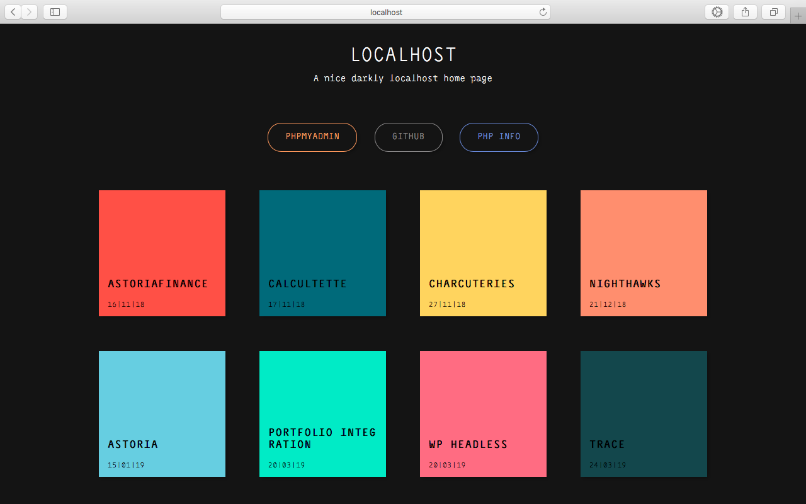
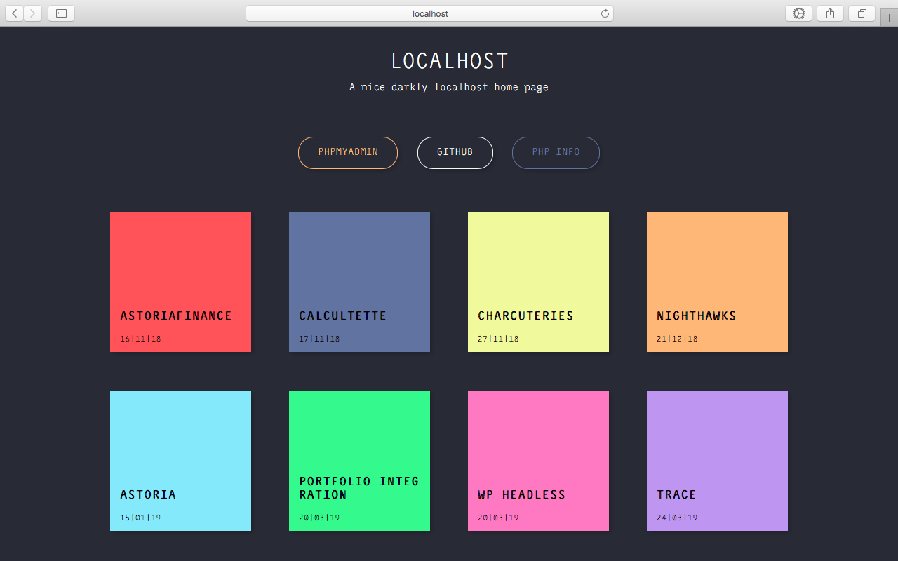

# LOCALHOST

[Localhost](https://github.com/Junscuzzy/localhost) is a simple minimalist darkly welcome page for your PHP projects.





## Installation

1. Download the repository
2. Place the `index.php` & `assets/` folder 
at the root of your local server.

> For example in UNIX system, if your public dir is named `/var/www/html/`, place it like this:
```bash
/var/www/html/
  index.php
  assets/
  ...rest of your projects
```

## Usage

Just start your PHP server and go to your index like `http://localhost`.

You can switch default theme with dracula theme at the begining of the `index.php`:

```php
<?php
// Config
$title = 'Localhost'; // string required
$description = 'A nice darkly localhost home page'; // string required
$menu = array(
  array("label" => "Phpmyadmin", "path" => "http://localhost/phpmyadmin", "class" => "pma"),
  array("label" => "Github", "path" => "https://github.com/", "class" => "github"),
  array("label" => "PHP info", "path" => "http://localhost/assets/utils/phpinfo.php", "class" => "php")
);
$theme = 'default'; // 'default' | 'dracula'
?>
```

## Contributing
Pull requests are welcome. For major changes, please open an issue first to discuss what you would like to change.

Please make sure to update tests as appropriate.

## License
[MIT](https://choosealicense.com/licenses/mit/)

## Credits 
Thanks at [Juliette R.](https://www.malt.fr/profile/julietterousseaux) for the wonderful design and
- [Tachyons](https://tachyons.io/): CSS functional framework 
- [Dracula](https://draculatheme.com/): Color palette 
